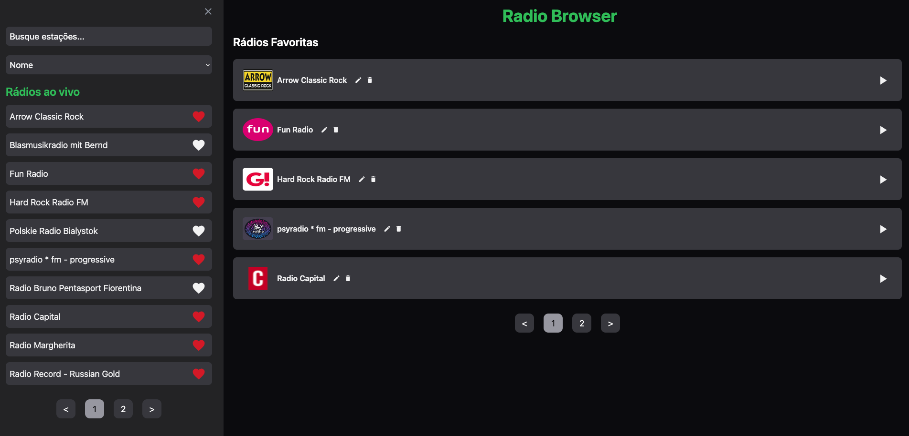
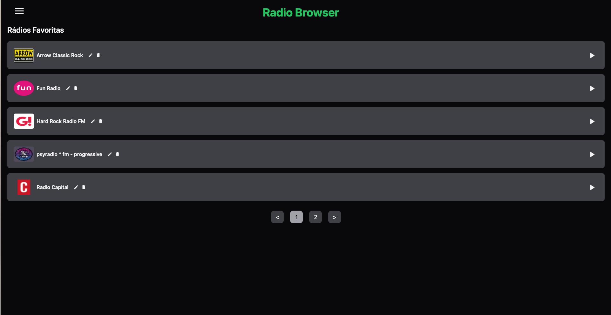
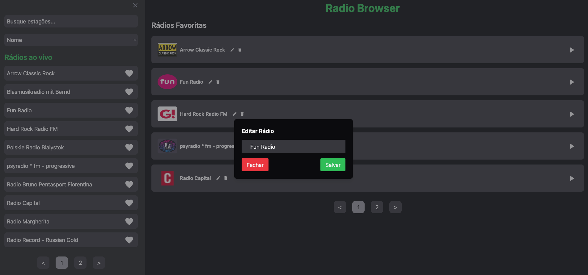
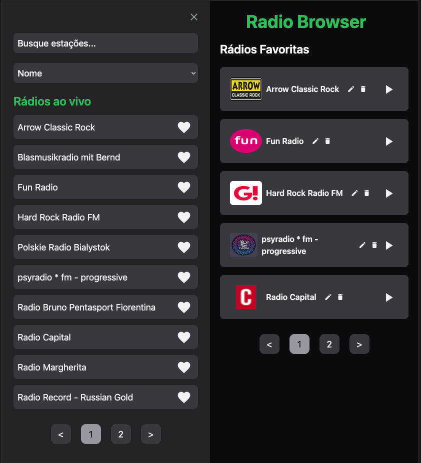
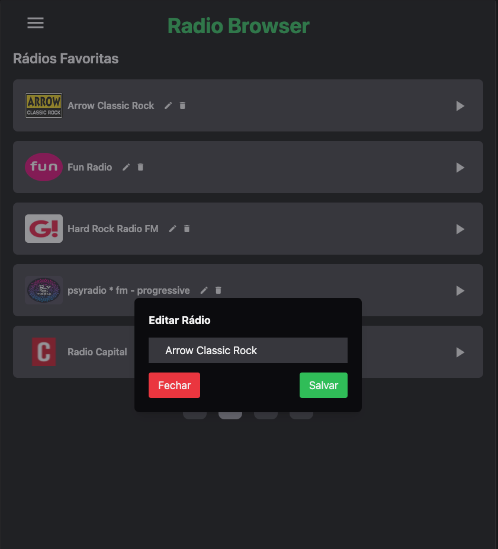
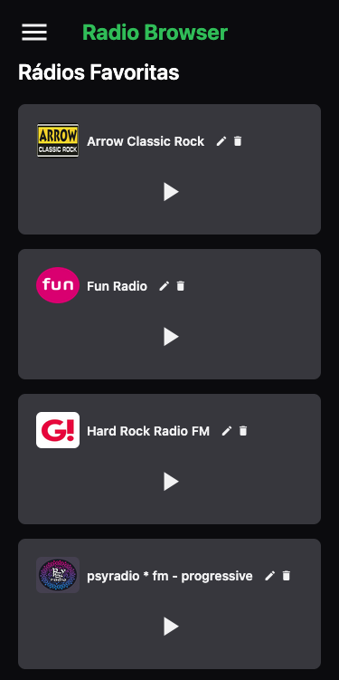
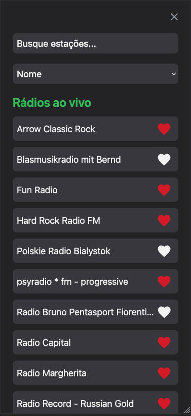
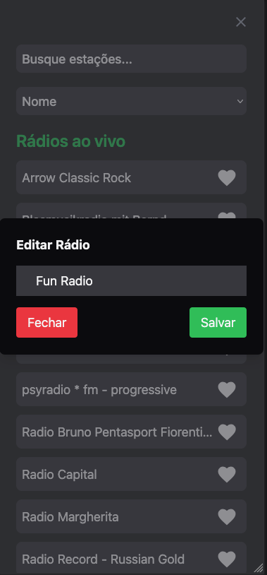

# Radio Browser Challenge

## Descrição
  
Esta é a solução de desafio de conhecimentos de Front-end promovido pela [Coodesh](https://coodesh.com);
A aplicação permite que os usuários revivam a experiência do rádio, possibilitando a busca de estações por nome, país de origem e idioma. Além disso, os usuários podem adicionar estações aos favoritos, bem como editá-las e removê-las conforme desejarem.


## Tecnologias utilizadas: 
 - [Radio Browser - REST API](https://de1.api.radio-browser.info/json/stations/search?limit=10)
 - [Vue.js](https://vuejs.org) 
 - [Pinia](https://pinia.vuejs.org)
 - [Tailwind CSS](https://tailwindcss.com/)
 - [Material Design Icons](https://pictogrammers.com/library/mdi/)
 - [Vue Awsome Pagination](https://github.com/peshanghiwa/vue-awesome-paginate#readme)
 - [Axios](https://axios-http.com/ptbr/docs/intro)
    

## Telas para Desktop





## Telas para Tablet





## Tela para Mobile





## Funcionalidades:
- Adicionar estações de rádio à lista de favoritos.
- Visualizar a lista de estações favoritas.
- Reproduzir e pausar a transmissão de uma estação de rádio.
- Editar o nome das estações de rádio favoritas.
- Remover estações de rádio dos favoritos.
- Buscar estações de rádio por nome, país e idioma.
- Persistir os dados no localStorage para manter as preferências do usuário.
- Visualizar interface responsiva, adaptável a diferentes dispositivos.


## Instruções de instalação: 

### Resquistos 

Antes de começar, certifique-se de ter os seguintes requisitos instalados:
- [Node.js](https://nodejs.org/pt) (versão recomendada: 18 ou superior);
- [Git](https://git-scm.com/);

### Instalação

1. Clone o repositório:

```
git clone https://github.com/CarolineT9/radio-browser

```
2. Acesse a pasta do projeto:

```
cd radio-browser

``` 
3. Instale as dependências:

```
npm install

``` 

### Executar Projeto

Para rodar o projeto em ambiente de desenvolvimento, use:

```
npm run dev

``` 
